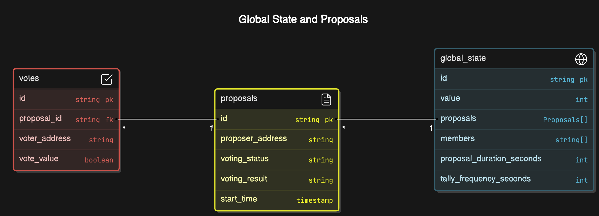
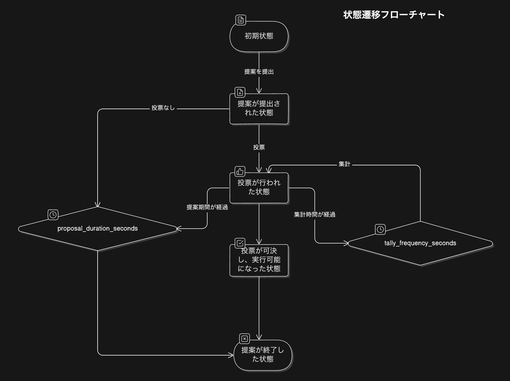
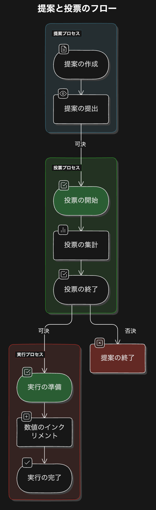

# Simpel DAO

- グローバルステートとして数値カウンターをメンバー間で共有することで DAO を表現する
- DAO のメンバーはカウンターのインクリメントを提案できる
- 提案に対し、DAO のメンバーは投票できる
- 投票結果を集計し、多数決で可決・否決を判定する
- 可決された場合、カウンターの値をインクリメントする

# Design

## ER Diagram

## State Transition Diagram

## Activity Diagram

